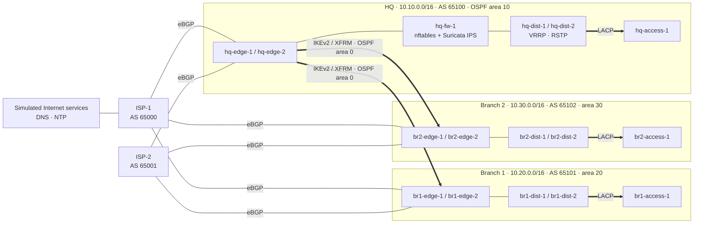

# Multi-Site Enterprise Network Lab

[](https://github.com/oplosy/netlab/actions/workflows/pull-request-policy.yml)

A reproducible, fully open-source enterprise network: three sites, two
simulated ISPs, encrypted overlays, a firewall and inline IPS tier, and full
telemetry. It is built from versioned intent in Git, deployed with
Containerlab, and **proven by automated failure tests rather than
screenshots**.

Every claim below links to a machine-generated acceptance report produced by a
documented `make` target.

## Highlights

- **40-node topology from one intent file.** Sites, nodes, links, VLANs,
  prefixes, and ASNs live in [`inventory/inventory.yaml`](inventory/inventory.yaml),
  are validated against a JSON schema, and render the Containerlab topology,
  device configuration, and Ansible inventory.
- **Resilient by design, measured on failure.** RSTP, LACP, and VRRP in each
  site; multi-area OSPF with BFD; dual-homed eBGP edges; and redundant
  route-based IKEv2 tunnels. Failovers are measured by probes, not asserted.
- **Security with negative tests.** nftables zone policy, OOB isolation, a
  routed HQ firewall tier, and an inline Suricata IPS that fails closed. The
  tests prove that denied traffic is denied, with counters and logs.
- **Evidence you can correlate.** One run ID ties firewall decisions, IDS
  alerts, packet captures, IPFIX flows, SNMPv3 metrics, and syslog in Loki
  together.
- **Automation with drift detection.** A rebuildable NetBox projection, a
  staged Ansible change workflow (precheck → backup → diff → apply →
  postcheck), idempotent applies, and failing reports on device or intent
  drift.
- **Pinned and gated.** Every package and image is version-pinned with
  digests. Each pull request runs a static quality gate and a resource-bounded
  Containerlab smoke test in CI.

## Topology



Every infrastructure node also sits on a separate out-of-band management
network that user and guest traffic cannot reach. Each site hosts its own
DHCP, DNS, and NTP services, and a shared RADIUS server provides AAA for
device SSH. More diagrams are in
[docs/architecture](docs/architecture/overview.md).

## Measured results

All numbers come from the latest automated acceptance runs in
[`evidence/reports`](evidence/reports).

| Area | What was proven | Result |
|---|---|---|
| Phase 1 full acceptance | Clean deploy → L2/L3, IPsec, OSPF, services, security, observability → clean teardown | **25/25 stages, 25/25 thresholds** |
| OSPF + BFD | Packet interruption when a distribution path fails | **0.501 s** (limit 3 s) |
| LACP / RSTP | Maximum reply gap during member or root failure | **≤ 0.112 s** (limits 1 s / 5 s) |
| IPsec | Rekey gap; underlay capture of 364 ESP, 28 IKE, and **0 cleartext** enterprise packets | **0.100 s** (limit 3 s) |
| Dual ISP / edge | Convergence after provider, edge, and tunnel failure | **1.04 s / 0.90 s / 5.36 s** (limit 10 s) |
| SecureEdge | Allowed, IPS-blocked, and firewall-blocked flows correlated across firewall, IDS, pcap, and IPFIX | **3/3 cases** |
| Automation | Second apply changes nothing; device and intent drift both fail the report | **PASS** |

Reports: [Phase 1](evidence/reports/phase-1.md) ·
[Phase 2](evidence/reports/phase-2.md) ·
[Phase 3](evidence/reports/phase-3.md) ·
[Phase 4](evidence/reports/phase-4.md) ·
[automation](evidence/specs/automation).

## Technology

| Layer | Components |
|---|---|
| Platform | Containerlab 0.77 on WSL2, Docker Engine, Ubuntu 24.04 images |
| Switching | Open vSwitch (VLANs, RSTP, LACP, IPFIX), Linux bonding |
| Routing | FRR 8.4 (OSPF, BGP, BFD), keepalived VRRP |
| Encryption | strongSwan 5.9 `swanctl`, IKEv2 with certificates, Linux XFRM interfaces |
| Security | nftables zone policy, Suricata 7 inline IPS via NFQUEUE |
| Services | Kea DHCP, BIND 9, chrony, FreeRADIUS, OpenSSH with RADIUS AAA |
| Observability | Prometheus, SNMPv3 exporter, Grafana, Loki, syslog-ng, Alloy, GoFlow2 |
| Automation | Python render and apply engine, Ansible, NetBox 4.4 |
| Quality | uv, pytest, ruff, yamllint, ansible-lint, GitHub Actions |

## Quick start

Requirements: a WSL2 Linux distribution with Docker Engine and Containerlab.
See the [environment runbook](docs/runbooks/environment.md).

```sh
make preflight          # read-only host and toolchain checks
make images             # build the pinned network, client, and service images
make lab-up             # deploy the topology
make evidence-phase-1   # full acceptance: deploy, test, and tear down
make lab-down
```

Other entry points:

| Command | Purpose |
|---|---|
| `make ci-static` | The CI quality gate, which needs no Docker |
| `make test-ipsec`, `test-ospf`, `test-l2`, `test-l3`, `test-security` | Focused live suites |
| `make evidence-phase-2` … `evidence-phase-4` | Failover, branch 2, and SecureEdge evidence |
| `make netbox-up netbox-sync` | Project the intent into NetBox |
| `make change`, `make test-drift` | Staged change workflow and drift report |

The step-by-step procedure is in the [Phase 1 runbook](docs/runbooks/phase-1.md).

## Repository layout

```text
inventory/      source-of-truth intent (JSON-compatible YAML) and its schema in schemas/
lab/            generated Containerlab topologies
config/         Python apply engines: gateways, IPsec, routing, switching, security
automation/     render, NetBox projection, Ansible playbooks, drift snapshots
services/       DHCP, DNS, NTP, and AAA definitions
observability/  Prometheus, Grafana, Loki, and flow collector stack
tests/          unit, integration, security, and end-to-end suites
evidence/       curated acceptance reports, specs, and captures
docs/           architecture, ADRs, runbooks, and plans
```

## Design and process

- The design is recorded in 19
  [architecture decision records](docs/adr/README.md), from the open network
  stack to the inline IPS and the automation model.
- Delivery happened in phases, each built on a `phase/<n>-<slug>` branch and
  merged through one reviewed pull request; `main` is never pushed to directly.
  See the [delivery workflow](docs/plans/workflow.md) and the
  [implementation plan](docs/plans/implementation-plan.md).

| Phase | Scope | Status |
|---|---|---|
| 0 | Foundation, governance, architecture | ✅ |
| 1 | HQ, branch 1, and ISP-1: switching, OSPF, IPsec, services, security, telemetry | ✅ |
| 2 | Second ISP, dual edges, eBGP multihoming, redundant overlays | ✅ |
| 3 | Branch 2 from a reusable site template | ✅ |
| 4 | CI quality gate and SecureEdge (firewall tier and inline IPS) | ✅ |
| 5 | Network automation: NetBox, Ansible, drift, CI smoke (stretch) | ✅ |

## Scope and limits

- The lab is self-contained. "Internet" means services behind the simulated
  ISPs; no test needs real Internet egress.
- The stack is vendor-neutral Linux: it demonstrates protocol behavior, not a
  vendor CLI.
- Private keys, certificates, and generated secrets are created locally and
  never committed.
