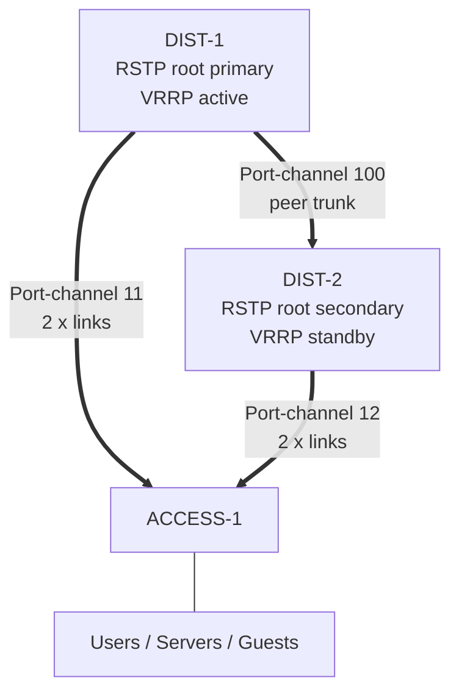
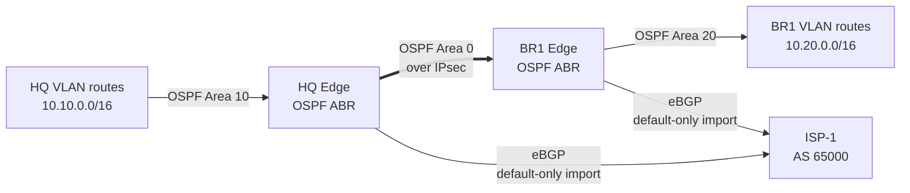
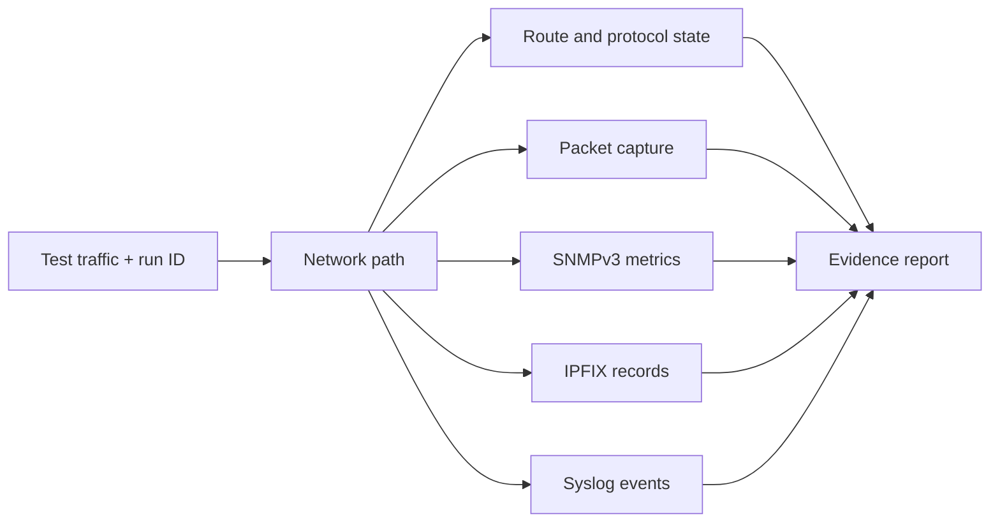

# Architecture Diagrams

## Site Layer 2 and gateway behavior

Each port channel terminates on one peer. RSTP sees each port channel as one
logical link and blocks the redundant loop. VRRP state is aligned with RSTP root
preference to avoid avoidable east-west forwarding.

## Routing boundaries

Site `/16` summaries cross Area 0. BGP routes are not generally redistributed
into OSPF; the edge conditionally originates a default while an Internet
default is present.

## Observability correlation

The run ID and timestamps are the correlation keys. A dashboard screenshot
alone is not proof; it must be tied to route state, packets, and the traffic
generator for the same run.
