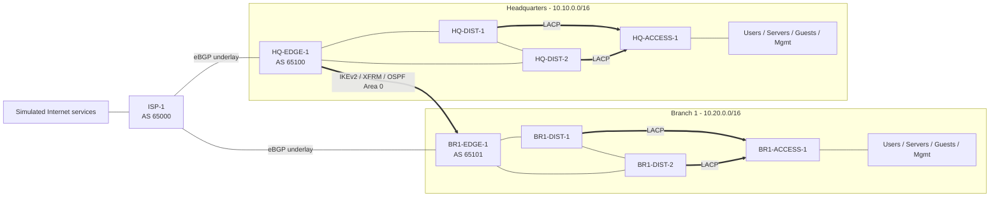

# Architecture Overview

## Scope

The project models an enterprise with a headquarters site, branch sites, and a
simulated Internet edge. Phase 1 completes one headquarters and one branch
end-to-end. The design intentionally supports later addition of a second ISP,
a second branch, a SecureEdge security layer, and a NetBox-backed automation
workflow.

The lab is deterministic and self-contained. "Internet access" in acceptance
tests means access to services hosted behind the simulated ISP. Real Internet
egress is outside the baseline and must not be required for functional tests.

## Platform boundary

Containerlab runs inside a dedicated WSL2 Linux distribution. Docker Engine and
the lab runtime live inside that distribution. Containerlab provides a separate
management network and point-to-point data links. The management network has IP
masquerading disabled so lab nodes do not gain accidental external access.

Network functions use open components:

- FRR for OSPF and BGP
- Open vSwitch for VLANs, RSTP, LACP, and IPFIX export
- Keepalived for VRRP
- strongSwan with `swanctl` and Linux XFRM interfaces for route-based IPsec
- nftables for zone and control-plane policy
- Linux containers for clients, servers, and operational services

This stack is vendor-neutral and redistributable. It demonstrates protocol
behavior, not a vendor-specific CLI. A licensed CML or cEOS edition may be added
later as a separate compatibility profile; it must not replace the open
baseline.

## Planes

### Data plane

Each site has users, servers, guests, and an in-band management VLAN. VLANs are
never stretched across sites. Site gateways are a redundant pair using VRRP.
Access and distribution switching use LACP port channels, with RSTP controlling
the remaining looped topology.

The Phase 1 site design is collapsed core/distribution. This is the correct
term for the two distribution nodes that also provide the site's Layer 3
boundary; there is no separate core tier in the initial topology.

### Routing plane

Enterprise routing uses OSPF:

- Area 0: encrypted inter-site XFRM links and site edge loopbacks
- Area 10: headquarters internal routed links and VLAN prefixes
- Area 20: branch 1 internal routed links and VLAN prefixes
- Area 30: reserved for branch 2

Site areas are normal OSPF areas. The site edge conditionally originates a
default only while a valid Internet default exists and summarizes the site's
`/16` toward Area 0. No broad protocol redistribution is permitted.

Internet underlay routing uses eBGP with one private ASN per enterprise site and
one ASN per simulated ISP. Enterprise RFC1918 prefixes are never announced to
an ISP. The ISP supplies a default route; outbound filters permit only explicit
lab endpoint prefixes.

### Encryption plane

Each branch forms an IKEv2 tunnel to headquarters using certificate
authentication. The tunnel uses an XFRM interface, carries OSPF Area 0, and
keeps routing independent from IPsec traffic selectors. Private keys and issued
certificates are generated locally and never committed.

### Management plane

Every infrastructure node has a dedicated interface on the Containerlab OOB
network. SSH, AAA, SNMPv3, syslog, orchestration, and administrative access use
this plane. User and guest traffic cannot route to it. The in-band management
VLAN exists for failure testing and emergency diagnostics, not as the primary
administrative path.

## Phase 1 topology

The double distribution/access links form distinct LACP port channels; a port
channel never spans two distribution nodes. RSTP blocks one redundant logical
path. This avoids pretending that ordinary LACP provides multi-chassis LAG.

## Failure domains

- A VLAN and its broadcast failure domain end at the site's distribution pair.
- A site summary ends at its Area Border Router.
- eBGP policy ends at each site edge.
- IPsec separates enterprise overlay routes from the ISP underlay.
- The OOB network is outside enterprise forwarding and routing protocols.
- Phase 1 intentionally has one edge per site and one ISP. Edge/ISP failure is
  therefore not redundant until Phase 2; this limitation must appear in every
  Phase 1 availability claim.

## Source of truth

Versioned YAML in Git is the authoritative design intent. It owns sites, nodes,
links, VLANs, prefixes, ASNs, and service endpoints. Rendered device
configuration and diagrams are derived artifacts.

NetBox is introduced in the automation phase as a queryable projection of this
intent. The repository remains sufficient to rebuild NetBox from an empty
database; manual NetBox-only changes are drift and must fail reconciliation.

## Definition of done

Phase 1 is complete only when all of the following are produced by documented
commands:

1. A clean deployment from pinned dependencies and an empty runtime state.
2. Measured LACP, RSTP, and routed-link failover results.
3. Successful corporate inter-site and simulated Internet traffic.
4. Failed guest-to-server, guest-to-management, and user-to-OOB tests.
5. An established IPsec SA plus underlay capture showing ESP rather than
   plaintext enterprise packets.
6. Route tables, packet capture, syslog, SNMP metrics, and IPFIX data that agree
   on the tested traffic path.
7. A teardown leaving no project-created containers, bridges, or namespaces.
